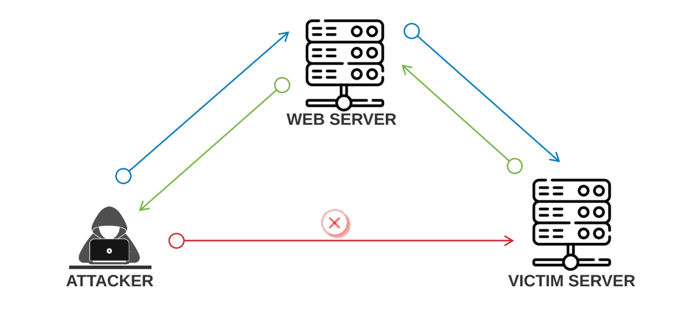

# Python安全编码和代码审计

1. command execute 命令执行
2. CSRF
3. file operator
4. file upload
5. guide dev
6. guide sec
7. shell reverse
8. SQL inject
9. XSS
10. DDoS
11. CC

## 1 前言

现在一般的web开发框架安全已经做的挺好的了，比如大家常用的django，但是一些不规范的开发方式还是会导致一些常用的安全问题，下面就针对这些常用问题做一些总结。代码审计准备部分见《php代码审计》，这篇文档主要讲述各种常用错误场景，基本上都是咱们自己的开发人员犯的错误，敏感信息已经去除。

## 2 XSS

#### 定义

跨站脚本攻击（Cross Site Script Attack），指利用网站漏洞从用户那里恶意盗取信息。
网站中包含大量的动态内容以提高用户体验，比过去要复杂得多。所谓动态内容，就是根据用户环境和需要，Web应用程序能够输出相应的内容。动态站点会受到一种名为“跨站脚本攻击”（Cross Site Scripting, 安全专家们通常将其缩写成XSS,原本应当是css，但为了和层叠样式表（Cascading Style Sheet,CSS ）有所区分，故称XSS）的威胁，而静态站点则完全不受其影响。

#### 简介

用户在浏览网站、使用即时通讯软件、甚至在阅读电子邮件时，通常会点击其中的链接。攻击者通过在链接中插入恶意代码，就能够盗取用户信息。攻击者通常会用十六进制（或其他编码方式）将链接编码，以免用户怀疑它的合法性。网站在接收到包含恶意代码的请求之后会产成一个包含恶意代码的页面，而这个页面看起来就像是那个网站应当生成的合法页面一样。许多流行的留言本和论坛程序允许用户发表包含HTML和javascript的帖子。假设用户甲发表了一篇包含恶意脚本的帖子，那么用户乙在浏览这篇帖子时，恶意脚本就会执行，盗取用户乙的session信息。

#### 攻击分类

（1）持久型跨站：最直接的危害类型，跨站代码存储在服务器（数据库）。
（2）非持久型跨站：反射型跨站脚本漏洞，最普遍的类型。用户访问服务器-跨站链接-返回跨站代码。
（3）DOM跨站（DOM XSS）:DOM(document object model文档对象模型)，客户端脚本处理逻辑导致的安全问题。

#### 危害

####

#### 工程

[XSS检测与过滤](./xss/XSS.md)

## 3 CSRF

#### 定义

跨站请求伪造

#### 工程

## 4 命令注入

#### 定义

#### 工程

## 5 sql注入

#### 定义

#### 工程

## 7 文件操作

#### 定义

#### 工程

## 8 文件上传

#### 定义

#### 工程

## 9 不安全的封装

#### 定义

## 10 SSRF

#### 定义

SSRF(Server-Side Request Forgery:服务器端请求伪造) 是一种由攻击者构造形成由服务端发起请求的一个安全漏洞。
一般情况下，SSRF攻击的目标是从外网无法访问的内部系统。（正是因为它是由服务端发起的，所以它能够请求到与它相连而与外网隔离的内部系统）

#### SSRF漏洞原理

SSRF 形成的原因大都是由于服务端提供了从其他服务器应用获取数据的功能且没有对目标地址做过滤与限制。

比如,黑客操作服务端从指定URL地址获取网页文本内容，加载指定地址的图片，下载等等。利用的是服务端的请求伪造。ssrf是利用存在缺陷的web应用作为代理攻击远程和本地的服务器

#### 工程

## 11 DDoS

#### CC

#### 工程

## 12 Webshell

## 10 总结

